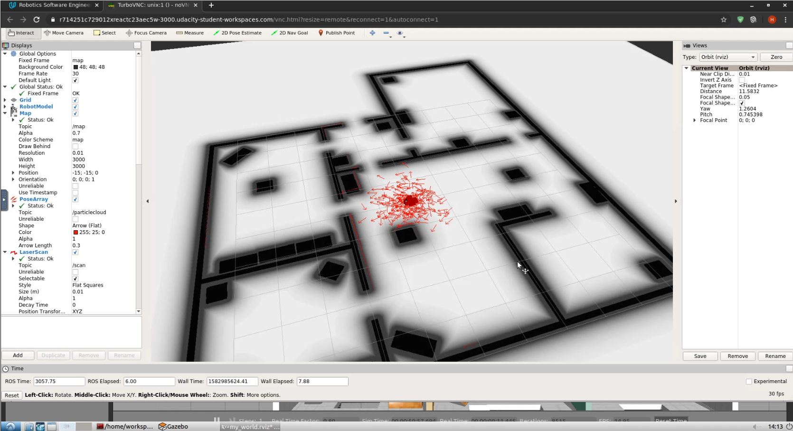
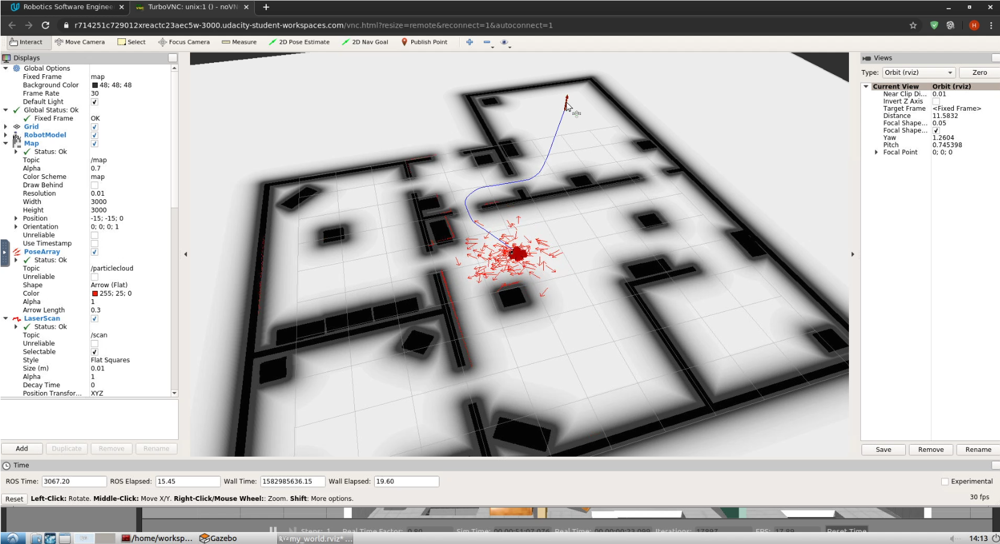
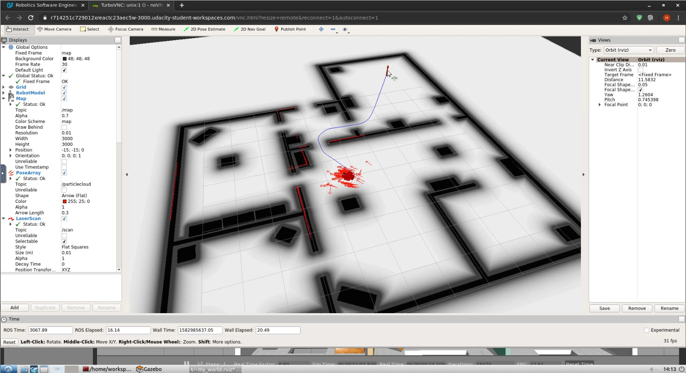
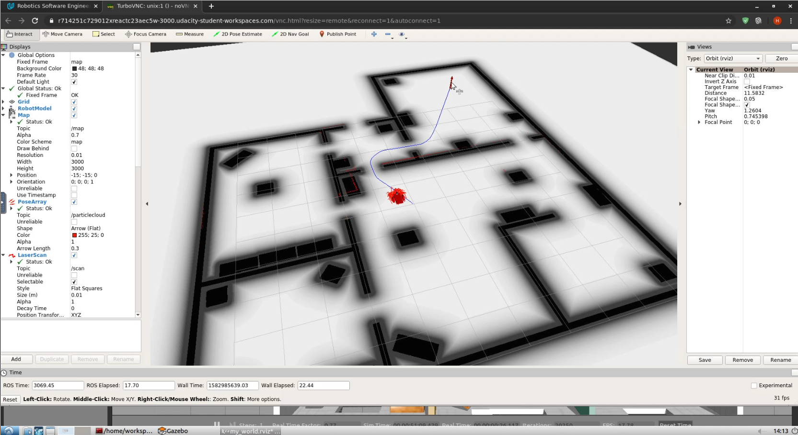
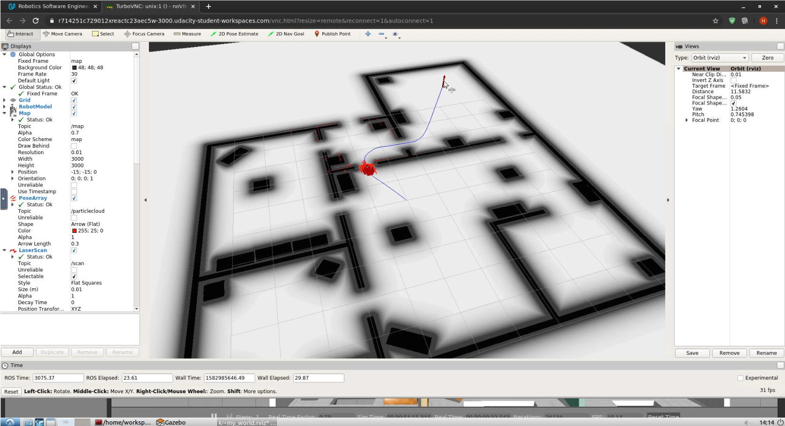
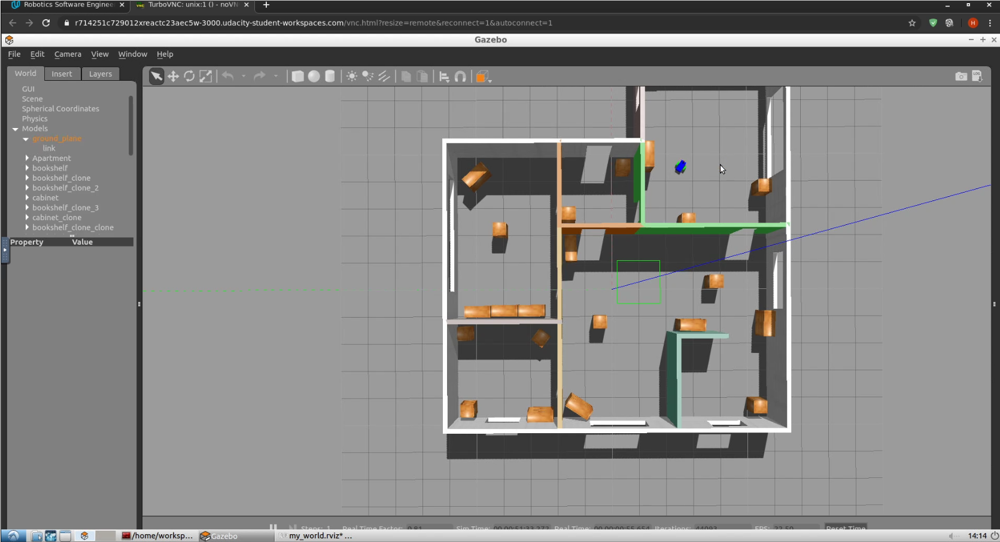
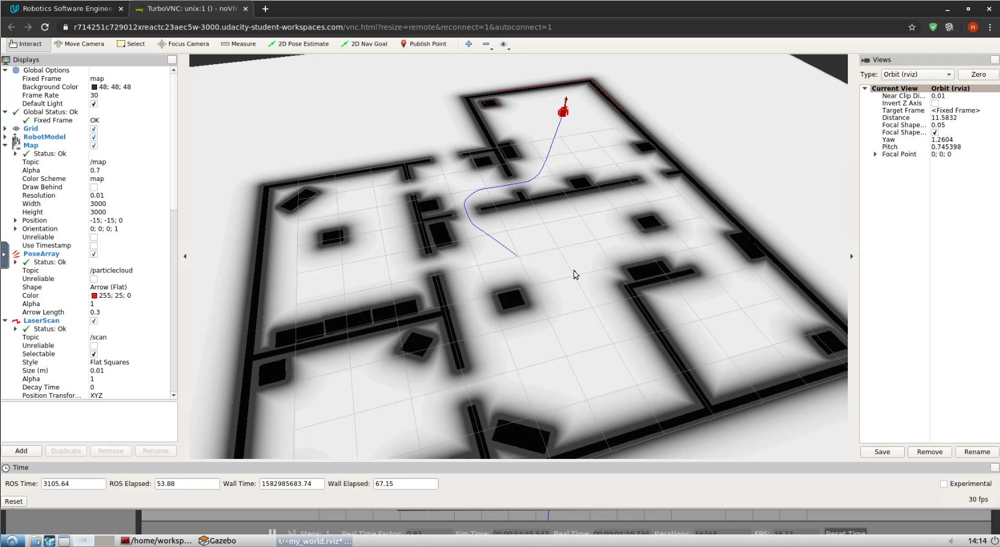
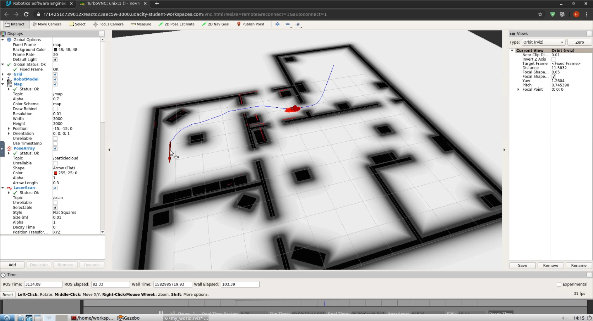
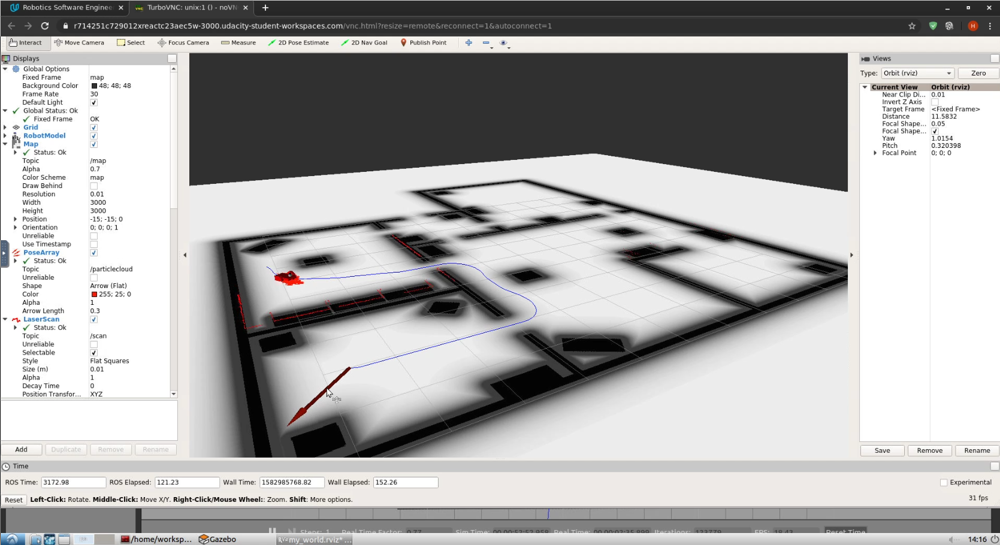
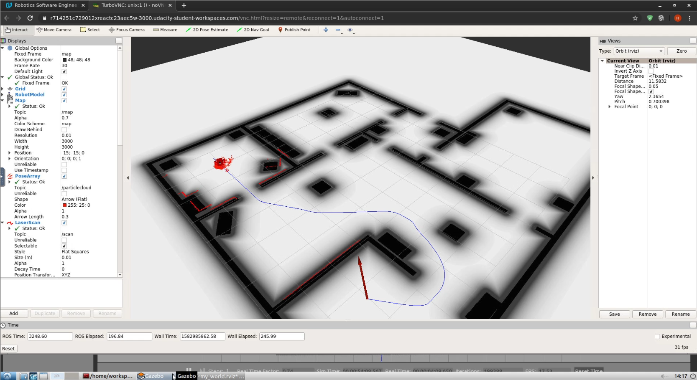

# Udacity Robotics Software Engineer Nanodegree - Project "Where Am I?"

## General
The Where Am I project of Udacity's Robotics Software Engineer Nanodegree covers the localization part in the robotics field. For this, the Adaptive Monte Carlo Localization method is used to localize a self created robot in an also self created virtual world, given a known map of the environment and using the robot's laser measurment data for localization.

## Build Instructions
To build the project, you need a working ROS Kinetic installation. For the project I used the given online workspace in the course, but any Ubuntu based Linux with ROS Kinetic installed should be fine.

Create a Catkin workspace and clone the repo into the src folder:

```console
# mkdir catkin_ws
# cd catkin_ws
# git clone https://github.com/heikoschmidt1187/RoboND-Where_Am_I src
```

After you've cloned the project, build it with catkin_make and source the corresponding bash settings:

```console
# catkin_make
# source devel/setup.bash
```

To run the simulation, launch the following ROS launchers. After that, you can place naviagtion goals anywhere on the map in RVIZ, and the robot will localize itself and follow a calculated trajectory to the goal:

```console
# roslaunch my_robot world.launch
# roslaunch my_robot amcl.launch
```

## Localization screenshots as part of the Project Rubrics
To give you an idea of how the localization and the movement to the target works, I've included a video showing some action [here](https://github.com/heikoschmidt1187/RoboND-Where_Am_I/blob/master/images/2020-02-29%2015-13-18.mp4?raw=true).

If you don't want to download the video, and to meet the project's requirements, please have a look at the following screenshots from the video.

Directly after launching the simulation, the robot is shown at it's initial position on the map, but currently not located as all particles are spread around the position due to the given uncertainties for x and y position, as well as the yaw angle:



After that, a first 2D Navigation Goal has been set. It's position and orientation is visualized with a red arrow. As you can see, the amcl trajectory planner has found the shortes path to the goal indicated by the blue path:



After only a few iterations it can seen that the number of particles decreased and that they are aligned well around the real robot position. Also the orientation is fine.




The robot is able to travel narrow parts in the world, like doors, quite well:



The real world movement can be followed in the Gazebo window:



At some point in time, the robot finally reaches its navigation goal and turns into the correct orientation:



I've tested the naviation, localization and movement with different goals and more complicated trajectories to follow. In the video you can see the following examples.

This one navigates the robot through a small room and two small doors:


This one is from another perspective, making the robot go from one room to another, again with small doors to cross:


The last one has some bigger radius and needs to traverse a room in a bigger radius:


I highly encourage you to try the handling yourself or at least watch the video to see the robot's movement as well as the laser scanner data visialized.
